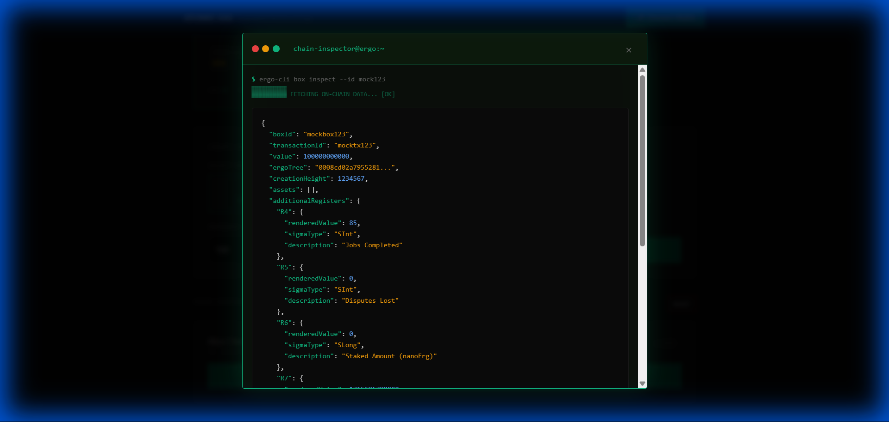
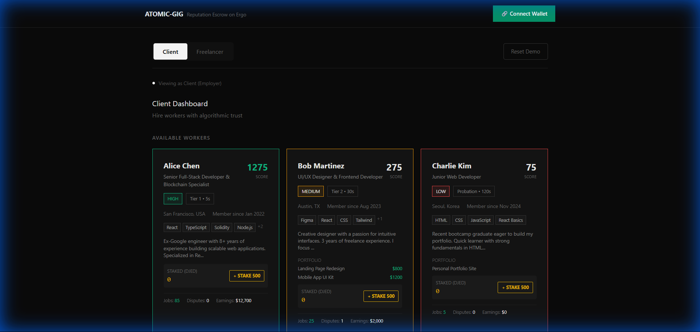

# Atomic-Gig: Trustless Decentralized Freelance Marketplace

  

**Atomic-Gig** is a next-generation freelance marketplace built on the **Ergo Blockchain**. It replaces centralized intermediaries (like Upwork or Fiverr) with smart contracts and an algorithmic reputation system. By leveraging Ergo's eUTXO model, we create a trustless environment where "Code is Law," but human reputation is preserved and valued.


---

## 🧐 The Problem
Traditional freelance platforms are broken:
- **High Fees:** Platforms take 20% of worker earnings.
- **Centralized Control:** Arbitrary bans and frozen funds.
- **Opaque Reputation:** Reviews can be fake or bought.
- **Slow Payments:** Workers wait days or weeks for withdrawal.

## 💡 The Atomic Solution
Atomic-Gig solves this with:
- **0% Middleman Fees:** Direct P2P payments via smart contracts.
- **Trustless Escrow:** Funds are locked on-chain, not held by a company.
- **Trinity Reputation:** A transparent, mathematical score based on verifiable on-chain history.
- **Instant Settlement:** Payments are released immediately upon contract unlock.

---

## 🏗️ Technical Architecture

### 1. The Trinity Reputation Model
Unlike simple 5-star ratings, Atomic-Gig uses a multi-variable formula derived from on-chain registers. This "Trinity" balances activity, reliability, and commitment.

**The Formula:**
```math
\text{Score} = (R4 \times 15) - (\text{TimeWeightedDisputes}) + (R6 \div 10)
```

| Register | Component | Description | Register Type |
| :---: | --- | --- | :---: |
| **R4** | **Jobs Completed** | +15 points per job. Direct measure of experience. | `SInt` |
| **R5** | **Disputes Lost** | Large penalty (-100) that decays over time. | `SInt` |
| **R6** | **Stake (NanoErg)** | +1 point per 10 staked units. Signals "Skin in the game". | `SLong` |

**Trust Tiers & Unlock Times:**
Higher reputation = Faster access to funds.
- **🟢 Tier 1 (>700 pts):** 5-second unlock (Instant Trust)
- **🟡 Tier 2 (200-700 pts):** 30-second unlock (Cautionary)
- **🔴 Probation (<200 pts):** 120-second unlock (High Risk)

### 2. Tech Stack
- **Frontend:** React 18, TypeScript, Vite
- **Styling:** CSS Modules, Custom Animations, Glassmorphism UI
- **Blockchain Interaction:** 
    - **Fleet SDK:** Transaction building and box composition.
    - **Nautilus Wallet:** dApp connector for signing interactions.
- **State:** React Context API (No Redux/Zustand needed for this scale).

---

## 🚀 Key Features


### Chain Inspector
A built-in **"Matrix Mode"** developer tool.
- Click "View Box Data" on any contract.
- See the raw JSON representation of the Ergo Box.
- Visualize exactly what data (R4, R5, R6) is determining the logic.



### Fiverr-Style Profiles
Visualizing the on-chain data in a human-friendly way.
- **Tags:** Skills extracted from metadata.
- **Portfolio:** Verified past transaction history.
- **Badges:** Trust Tier visual indicators.

---

## � Getting Started

### Prerequisites
1.  **Node.js** (v16 or higher)
2.  **Nautilus Wallet** (Browser Extension)
    *   *Note: For the demo, you can use the built-in "Simulated Wallet" if you don't have Testnet ERG.*

### Installation

```bash
# Clone the repository
git clone https://github.com/your-repo/atomic-gig.git

# Navigate to directory
cd atomic-gig

# Install dependencies
npm install

# Run development server
npm run dev
```

### Usage Guide (Demo Flow)



1.  **Login:** Connect your wallet.
2.  **Act as Client:**
    *   Browse the "Available Workers" grid.
    *   Notice the different Trust Tiers (Green/Yellow/Red).
    *   Select **Alice** (Expert) or **Bob** (Newbie).
    *   Lock a payment (e.g., 100 ERG).
3.  **Act as Worker:**
    *   Switch the toggle at the top to **Freelancer**.
    *   Select the worker profile you hired.
    *   See the "LOCKED" contract.
    *   Click **SUBMIT WORK** to start the unlock timer.
4.  **Test the Reputation System:**
    *   Go to **Bob's** profile (Yellow Tier).
    *   Click **[ + STAKE ]**.
    *   Watch his score rise. Once it hits 700, he instantly becomes **Green Tier**.
5.  **Test a Dispute:**
    *   Hire **Charlie** (Red Tier).
    *   Submit work.
    *   Switch to Client and click **REPORT ISSUE** before the timer ends.
    *   See the UI turn Red.
    *   Use the Admin buttons to **Force Refund**.
    *   Charlie's score will plummet.

---

## 🔮 Future Roadmap

- [ ] **Decentralized Arbitration:** Replace Admin buttons with a Kleros-style jury system using Ergo tokens.
- [ ] **Encrypted Chat:** On-chain messaging between parties.
- [ ] **Stablecoin Support:** Allow payments in SigUSD specific implementations.
- [ ] **Identity NFT:** Minting the Reputation Score as a transferable (or soulbound) NFT.

---

## 🏆 Hackathon Notes
This project was built for the **Ergo Unstoppable Hackathon**
**Team Elites** : Ayush Khubchandani, Md Hammaduddin and Gautam Gupta

